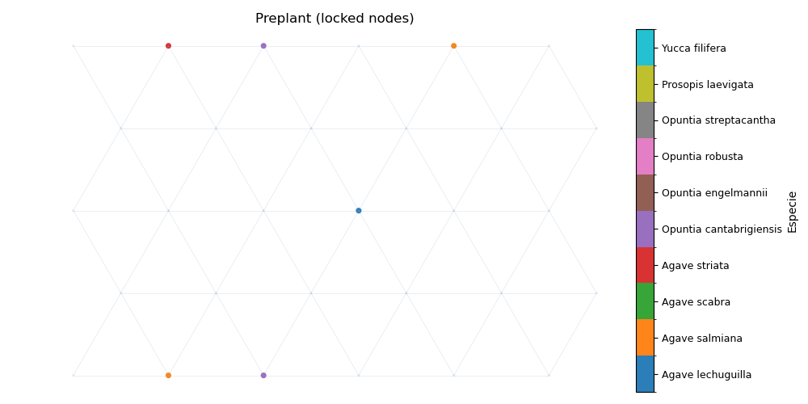

# Resultado 

[Scoring with GA metrics]
[MILP] competencia_avg = 0.973333   diversidad_dev = 0.400000
[BASE] competencia_avg = 0.100000   diversidad_dev = 1.200000

**Grid:** 5×5  **Nodes:** 25  **Edges:** 69 **Avg. Degree:** 4.48  
**Status:**  Optimal  **Objective:** 29.2  
**Variables:** x = 250  y = 6900 **Constraints:** 20810  
## Preplantado

| Species                    | Count | Target | Band [L,U] |
|-----------------------------|:------:|:-------:|:-----------:|
| Agave lechuguilla           | 3 | 2 | [1, 3] |
| Agave salmiana              | 6 | 7 | [6, 8] |
| Agave scabra                | 1 | 2 | [1, 3] |
| Agave striata               | 1 | 2 | [1, 3] |
| Opuntia cantabrigiensis     | 2 | 2 | [1, 3] |
| Opuntia engelmannii         | 1 | 1 | [0, 2] |
| Opuntia robusta             | 3 | 3 | [2, 4] |
| Opuntia streptacantha       | 3 | 2 | [1, 3] |
| Prosopis laevigata          | 3 | 3 | [2, 4] |
| Yucca filifera              | 2 | 1 | [0, 2] |

